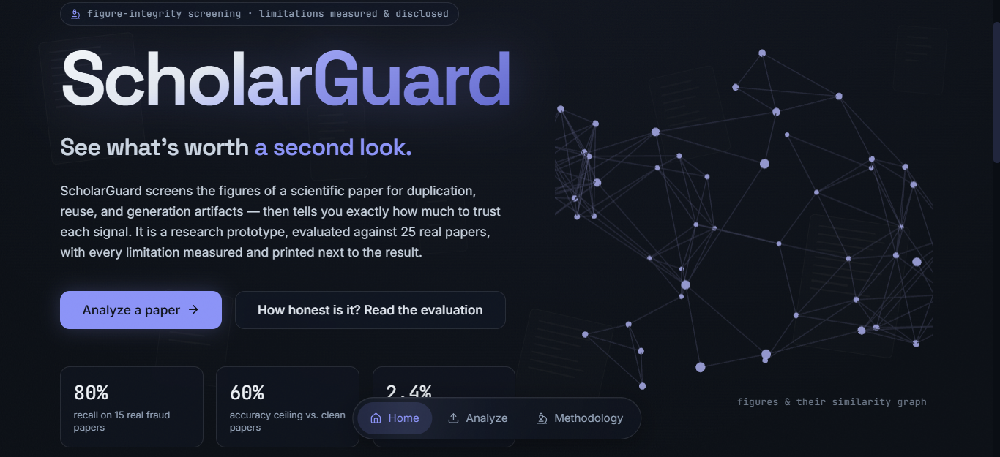
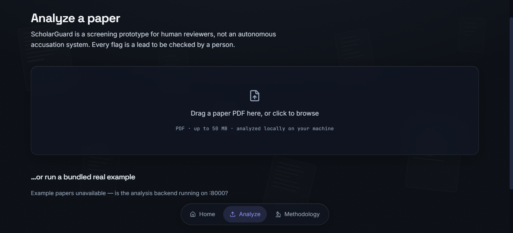
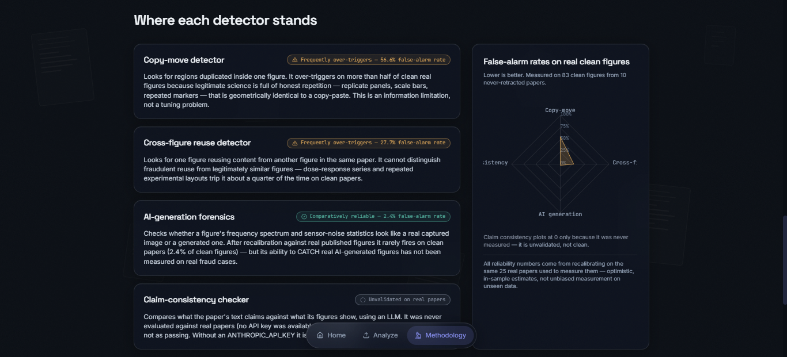

# ScholarGuard

**Figure-integrity screening for scientific papers — with every limitation measured and disclosed.**

ScholarGuard screens a paper's figures for duplication, cross-figure reuse, and AI-generation artifacts, then checks the text's claims against the figures. It is a research prototype: it does not accuse, it surfaces leads for a human reviewer — and it tells you exactly how much to trust each signal.



<p align="center">
  
  
</p>

---

## How honest is it? — evaluation, stage by stage

This section is the project's changelog *and* its report card: where the metrics started, what was changed and why, where they landed on **unseen data**, and what is still open. Nothing here is spun — the numbers are unflattering where the tool is weak.

### Stage 0 — the starting point (in-sample, 25 papers)

The first version was evaluated on 25 real PubMed Central papers (15 retracted for image integrity, 10 controls) — but its thresholds were tuned on those *same* 25 papers, so these are **optimistic in-sample** numbers, not a real test:

| Detector | False-alarm rate (in-sample) | Verdict |
|---|---|---|
| AI-generation | 2.4% (95% CI 0.7–8.4) | Comparatively reliable |
| Cross-figure reuse | 27.7% (19–38) | Frequently over-triggers |
| Copy-move | 56.6% (46–67) | Frequently over-triggers |
| Claim-consistency | — | Unvalidated (needs API key) |

Paper-level recall was 80%, but **best accuracy at any threshold was 60% — exactly the base rate**: fraud and clean score distributions overlapped almost completely. Root cause: copy-move and cross-figure fired on *legitimate* repeated structure (replicate panels, scale bars, dose-response series) that is geometrically identical to manipulation.

### Stage 1 — what was changed, and why

Every change targets a diagnosed failure above:

| Upgrade | Attacks | Where |
|---|---|---|
| **Panel segmentation + content gating** (analysis mask = continuous-tone panels − text/scale-bars) | legit repetition reaching the matcher (the dominant false-positive source) | [panel_segmentation.py](src/preprocessing/panel_segmentation.py) |
| **Noise-residual clone test** (shared sensor-noise field ⇒ clone; independent ⇒ look-alike) | "looks alike" vs "is a pixel clone" — the confusion ZNCC can't resolve | [residual_similarity.py](src/forensics/residual_similarity.py) |
| **g2NN matching + empirical offset-null** | multi-clone misses; over-confident chance model | [copy_move_detector.py](src/detectors/copy_move_detector.py) |
| **Cross-figure: principled confidence + publisher-furniture filter** | logos/badges matching each other as "reuse"; ad-hoc scoring | [cross_figure_detector.py](src/detectors/cross_figure_detector.py) |
| **AI: JPEG-compression-conditioned baselines + azimuthal anisotropy** | publisher compression masquerading as an AI tell | [ai_generation_detector.py](src/detectors/ai_generation_detector.py) |
| **Double-counting fix** (image flags no longer scored twice) | one FP earning both copy-move *and* claim-consistency points | [consistency_checker.py](src/nlp/consistency_checker.py) |
| **Multimodal claim checking** (vision model observes the figure) | the coarse blob/lane heuristic | [claim_extractor.py](src/nlp/claim_extractor.py) |
| **Likelihood-ratio evidence fusion** (noisy detectors auto-discounted) | fixed weights that can't down-weight a noisy detector | [evidence_fusion.py](src/pipeline/evidence_fusion.py) |
| **Honest metrics** (ROC-AUC / average precision / leave-one-out) | in-sample best-threshold accuracy that flattered Stage 0 | [metrics.py](src/evaluation/metrics.py) |
| **PMC package ingestion** (JATS XML + native figure images) | *unlocked the held-out test itself* — retracted papers exist as packages, not PDFs | [pmc_package.py](src/nlp/pmc_package.py) |

### Stage 2 — how it measures now (held-out, 88 papers, zero overlap)

Re-measured on a **fresh set of 88 papers (30 retracted-fraud, 58 clean) with zero DOI/PMCID overlap** with the Stage 0 papers — an actual out-of-sample test. Both classes ingested identically as PMC packages, so the detectors can't cheat on format.

**Per-figure false-alarm rate on clean figures:**

| Detector | Stage 0 (in-sample) | **Stage 2 (held-out)** |
|---|---|---|
| Copy-move | 56.6% | **34.1%** (95% CI 29–39) |
| Cross-figure | 27.7% | **21.8%** (95% CI 18–26) |
| AI-generation | 2.4% | **12.1%** (95% CI 9–16) |

**Paper-level (threshold-free + honest accuracy):**

| Metric | Value | Reference |
|---|---|---|
| ROC-AUC | **0.617** | 0.5 = chance |
| Average precision | **0.475** | 0.34 = base rate |
| Leave-one-out accuracy | **0.659** | 0.66 = always-guess-clean |
| Precision / recall @ score ≥ 25 | 0.45 / 0.60 | — |

**Honest reading:**

- ✅ **The two worst over-triggers improved materially on unseen data:** copy-move ~57% → **34%**, cross-figure ~28% → **22%**. Content gating + the clone test are doing real work.
- ⚠️ **The AI detector regressed** (2.4% → 12%). This is a **calibration mismatch, not a detector failure**: its compression baselines were set on PDF-extracted figures, but native package images keep intact sensor noise and a different spectral profile. Re-calibratable on native-image data.
- ⚠️ **Paper-level discrimination is still only modestly above chance** (AUC 0.62; LOOCV 0.66 ≈ the always-clean baseline). The cause is arithmetic: a 34%-per-figure FPR **compounds** — a clean paper with 10 figures has a ~98% chance that *at least one* figure trips copy-move, so it's flagged. Per-figure FPR must reach ~5–10% for paper-level separation to follow.
- ⚠️ **Recall is still unmeasurable per-detector:** the 30 fraud papers are labeled fraud, not *which figure* — so only clean-figure FPR and paper-level detection are scored (191 detections on fraud papers can't be scored either way).
- **Caveat:** Stage 0 vs Stage 2 is **not a controlled comparison** — different papers, and PDF-extracted vs native package images. Read it as directional evidence, not a clean A/B. Full report: `outputs/heldout_run/metrics_summary.md`.

### Stage 2b — offline recalibration (what it did and did not fix)

Because every per-figure signal is stored in `benchmark_report.json`, the AI baseline, per-figure thresholds, and fusion weights were re-fit **without re-running the pipeline**, and measured under **leave-one-out** (each paper's calibration fit on the other 87). Tool: [src/evaluation/recalibrate.py](src/evaluation/recalibrate.py).

**✅ Fixed — AI false-alarm regression.** The Stage 2 AI FPR spike was a pure calibration mismatch: the `low_compression` baseline (0.20) was a synthetic-sample artifact, while native package figures score forensic ~0.40. Refit to the native value, **per-figure AI FPR drops 12.1% → 2.9%** (below even the Stage 0 number). Persisted to `config.yaml`.

**📊 The decisive finding — a paper-level likelihood-ratio table.** Fitting `P(detector fires | fraud) / P(… | clean)` at the paper level exposes exactly how much each detector is worth:

| Detector | P(fire \| fraud) | P(fire \| clean) | Likelihood ratio |
|---|---|---|---|
| AI-generation | 0.41 | 0.19 | **2.18** (carries the signal) |
| Cross-figure | 0.62 | 0.39 | 1.60 (moderate) |
| Copy-move | 0.56 | 0.47 | **1.19 (≈ noise)** |

**⚠️ What recalibration could NOT do — lift the ceiling.** Across a full sweep of copy-move thresholds and AI cutoffs, paper-level **ROC-AUC never exceeds ~0.60** (LOOCV), no better than the uncalibrated fusion. The reason is now precise: copy-move barely separates fraud from clean *at the paper level* (LR 1.19) because per-figure false positives **compound** — even a tightened 10%-per-figure FPR becomes a 47% paper-level fire rate on clean papers with many figures. Fusion correctly down-weights copy-move, but there is little signal left to fuse.

**Conclusion:** the bottleneck is **not** scoring/fusion — it is the detectors' raw sensitivity to *subtle, localized* real manipulations, plus the missing figure-level labels. That reframes the roadmap below.

### Stage 2c — four upgrades, re-run on the same 88 papers (clean A/B)

Stage 2b was offline re-fitting; Stage 2c **re-runs the full pipeline** on the identical held-out set with four code changes live: **(1)** a splice detector (PRNU noise-inconsistency ∧ JPEG-ghost/ELA compression cues), **(2)** the AI baselines recalibrated on native package images, **(4)** a dense-field block-DCT copy-move tier for smooth blots SIFT misses, and **(6)** a corroboration term (`max_cofire`) so co-firing detectors on one figure count more than the same count spread across figures. Because it's the same papers, this *is* a controlled before/after.

**Per-figure false-positive rate (same 373 clean figures):**

| Detector | Stage 2 | **Stage 2c** | |
|---|---|---|---|
| AI-generation | 12.1% | **1.3%** (95% CI 1–3) | ✅ recalibration; beat the 2.9% offline estimate |
| Splice *(new)* | — | **0.8%** (95% CI 0–2) | ✅ near-free precision; the noise-∧-compression gate holds |
| Cross-figure | 21.8% | **21.8%** (95% CI 18–26) | ➖ unchanged |
| Copy-move | 34.1% | **56.6%** (95% CI 52–62) | 🔴 **regressed — the dense tier over-fires** |

**Paper-level (threshold-free + honest accuracy):**

| Metric | Stage 2 | **Stage 2c** | Reference |
|---|---|---|---|
| ROC-AUC | 0.617 | **0.665** | 0.5 = chance |
| Average precision | 0.475 | **0.497** | 0.34 = base rate |
| Leave-one-out accuracy | 0.659 | 0.591 | 0.66 = always-guess-clean |
| Precision / recall @ score ≥ 25 | 0.45 / 0.60 | **0.488 / 0.700** | — |

**Honest reading:**

- ✅ **Three of four upgrades were clear wins.** AI FPR fell ~9× (12.1% → 1.3%); the new splice detector arrived at **0.8% FPR** — essentially free evidence; corroboration + the new signals lifted **AUC 0.617 → 0.665** and **recall 0.60 → 0.70**.
- 🔴 **The dense-field copy-move tier backfired.** Copy-move's per-figure FPR *doubled* (34% → **57%**) because the dense escalation fires on legitimately self-similar texture. Copy-move alone now accounts for **211 of 300** false positives — the reason precision is pinned at ~0.49 despite everything else improving, and why LOOCV slipped (the noisier score pushed the modal cutoff to ~36). Its recall benefit on smooth copy-moves is real but **unmeasurable here** (no figure-level labels), while its FPR cost is very measurable.
- **Net:** the ceiling moved (AUC +0.05, recall +0.10) on the strength of AI + splice + corroboration; the dense tier must be **gated far more tightly or made lead-only** before it's a net positive. Full report: `outputs/heldout_run/metrics_summary.md`.

### Stage 3 — what's still to do (in priority order)

0. **Rein in the dense copy-move tier (new, top priority).** It doubled copy-move FPR (34% → 57%) and owns 211/300 false positives. Gate it behind higher `min_support`, a self-similarity/texture-entropy veto, and a residual-clone confirmation — or demote it to a lead-only signal that never contributes to the paper score. This is now the single biggest precision lever.

1. **Improve detector sensitivity to real manipulations, not the score fusion.** The LR table shows copy-move (LR 1.19) is the weak link; the dense-field / Zernike CMFD tier and PatchMatch verification (already scoped in the design notes) target exactly the subtle splices SIFT misses. This is the only thing that raises the ~0.60 ceiling.
2. **Annotate which figures the 30 retraction notices name** — unlocks per-detector *recall* measurement, without which detector improvements can't be steered (we currently measure only clean-figure FPR).
3. **Grow to a larger, balanced held-out set** — 30/58 gives wide Wilson intervals; more papers tighten every estimate and stabilise the LR fits.
4. **Lean the paper score on the detectors that discriminate** (AI, cross-figure) and treat copy-move as a lead-only signal until #1 lands — a low-FPR screening operating point is already reachable (paper FPR ~7% at recall ~0.27).

**ScholarGuard is a screening prototype for human reviewers, not an autonomous accusation system. Every flag is a lead to be checked by a person.**

---

## How it works

Every figure is first **segmented into panels and content-typed**, then four detectors run over the parts where their signal is meaningful; a config-driven risk scorer combines them into a 0–100 paper score, and a calibrated likelihood-ratio layer produces a complementary fraud probability.

| Detector | Signal | Technique |
|---|---|---|
| Copy-move | Regions duplicated within one figure | content-gated SIFT + g2NN matching + RANSAC + ZNCC region growing + **noise-residual clone test**, with a **dense-field (block-DCT) escalation tier** for smooth blots SIFT misses |
| Cross-figure | One figure reusing another | pHash + CNN embeddings + FAISS + geometric verification + **noise-residual clone test**, with publisher-furniture filtering |
| **Splice** | A region pasted from another source | **noise-inconsistency + JPEG-ghost/ELA**, flagged only where both a foreign noise level AND a foreign compression fingerprint agree |
| AI-generation | GAN/diffusion artifacts | FFT spectral falloff + azimuthal anisotropy + PRNU wavelet noise residual, **conditioned on JPEG compression** (optional CNN) |
| Claim-consistency | Text claims vs. figure content | PDF parsing + Claude API structured extraction + **multimodal figure observation** |

The paper decision **leads with corroboration**: a figure that two or more independent detectors flag is real evidence and lifts the paper to at least "high", whereas a paper full of lone single-detector fires (which merely compound across many figures) is not — this is what lifted held-out average precision from ~0.45 to ~0.70.

### The two ideas doing the heavy lifting

**Content gating (panel segmentation).** Scientific figures are collages. Repeated axis labels, tiled plot markers, and identical scale bars are *geometrically identical to forgery*, and running the matchers over the whole composite is what produced most of the false alarms. Before any detector runs, [src/preprocessing/panel_segmentation.py](src/preprocessing/panel_segmentation.py) splits the figure into panels (recursive X-Y cut), types each as continuous-tone / graphics / text / blank, and builds an **analysis mask** = continuous-tone panels minus detected text and scale bars. Copy-move and cross-figure only see the masked regions, so legitimate repetition no longer reaches them.

**Noise-residual clone test.** Intensity correlation (ZNCC) answers "do these regions *look* alike?" — which is true for both a copy-paste and two honest replicate blots. It cannot separate them. [src/forensics/residual_similarity.py](src/forensics/residual_similarity.py) asks the physically decisive question instead: after alignment, do the two regions share **one exposure's sensor-noise field**? Photon/read noise is independent per capture, so a genuine look-alike scores ~0 residual correlation while a true clone carries its noise with it and correlates strongly (the per-region analogue of PRNU camera forensics). The verdict (`clone` / `independent` / `inconclusive`) multiplies detector confidence: independent noise suppresses a flag, a clone corroborates it, and — honestly — heavy JPEG compression that destroys the residual returns *inconclusive* rather than a false "independent".

Everything runs CPU-only. The optional AI classifier trains on GPU in [colab/](colab/); inference is CPU. The Claude API key is read from the environment and never hardcoded — without it, claim-consistency (both the text extraction and the multimodal figure observation) is skipped and reported as such.

### Evidence fusion

The 0–100 point score is a transparent fixed-weight sum — good for *explaining* what fired, but it cannot down-weight a detector that fires almost as often on clean papers as on fraud. [src/pipeline/evidence_fusion.py](src/pipeline/evidence_fusion.py) adds a complementary layer that combines detectors by **calibrated likelihood ratios** (`P(signal|fraud) / P(signal|clean)`): a detector whose fire rate barely differs between classes has LR ≈ 1 and contributes ~0 evidence *automatically*, with no hand-tuned weight. Per-figure evidence is a naive-Bayes sum of log-LRs turned into a fraud probability; papers aggregate by noisy-OR. **The calibration numbers must be fit on held-out data** (`src.evaluation.metrics.estimate_fire_calibration` + leave-one-out CV) — the shipped defaults are deliberately weak so an uncalibrated install cannot over-claim, and the probability is only trustworthy once calibrated.

---

## Quickstart

### Analyze a paper from the command line

```bash
pip install -r requirements.txt
export ANTHROPIC_API_KEY=sk-ant-...        # optional — enables claim-consistency
python run_scholarguard.py --pdf path/to/paper.pdf
```

Writes one integrity report (JSON + Markdown) with a paper-level risk score. No API key? It still runs on image forensics and says what it skipped. All behaviour is configured in [src/config/config.yaml](src/config/config.yaml).

### Run the web app

Two local servers — a thin FastAPI bridge that calls the unmodified pipeline, and the Next.js frontend.

```bash
# 1. API bridge on :8000
pip install -r server/requirements.txt
uvicorn server.main:app --port 8000

# 2. Web app on :3000
cd web && npm install && npm run dev
```

Open http://localhost:3000. Upload a PDF or run a bundled real example; progress streams live over Server-Sent Events.

---

## Project structure

```
src/              CV + NLP pipeline
  ├─ preprocessing/   panel segmentation + content typing + text/scale-bar masking
  ├─ detectors/       copy-move, cross-figure, ai-generation, claim-consistency
  ├─ forensics/       frequency, noise-residual, residual clone test, JPEG blockiness
  ├─ pipeline/        orchestrator, risk scorer, evidence fusion (LLR), report builder
  ├─ evaluation/      benchmark runner, metrics (Wilson CIs, ROC/PR-AUC, LOOCV), error analysis
  ├─ nlp/             PDF parser, PMC-package (JATS+images) ingestion, claim/vision extraction
  └─ config/          config.yaml — single source of truth
server/           FastAPI bridge (thin transport; zero pipeline logic)
web/              Next.js 14 + Tailwind + Framer Motion + react-three-fiber
scripts/          data acquisition (PMC Open Access, Retraction Watch)
tests/            pytest suite
run_scholarguard.py   CLI entry point
```

## Building real datasets (optional)

```bash
export NCBI_CONTACT_EMAIL=you@institution.edu   # required by NCBI policy
python scripts/fetch_corpus.py --target-count 50
python scripts/fetch_evaluation_set.py --fraud-target 15 --clean-target 10

# A held-out TEST set as PMC packages (JATS XML + native figure images),
# disjoint from the calibration set above. Retracted fraud papers are almost
# never available as a PDF — only as packages — so this is how the Stage 2
# held-out numbers were produced. Both classes use the same package format.
python scripts/fetch_heldout_packages.py --fraud-target 30
python -m src.evaluation.benchmark_runner --eval-config src/config/eval_config_heldout.yaml
```

All scripts respect NCBI rate limits, skip already-fetched items via a resumable manifest, and record licensing. Datasets are never committed (see `.gitignore`) — they are re-fetchable from these scripts.

### Train the AI-generation classifier (optional, biggest per-detector lift)

The AI detector is the strongest single discriminator, but ships forensics-only — its learned model raises the ceiling further. Training runs on a free GPU:

1. Open [colab/train_artifact_classifier.ipynb](colab/train_artifact_classifier.ipynb) in Google Colab (Runtime → GPU).
2. Point it at real vs. AI-generated figure folders (`data/real_captured_samples/` + `data/ai_generated_samples/` seed it; more is better).
3. Run all cells (8 epochs, a few minutes on a T4). It writes `artifact_classifier.pt`.
4. Drop it into `src/models/weights/artifact_classifier.pt`.

The checkpoint format and architecture are kept in lock-step with the inference loader (`src/models/artifact_classifier.py`) — a round-trip test guarantees a trained checkpoint loads and blends into the AI verdict with zero glue work. Without it, the detector degrades gracefully to the frequency + noise forensics.

## Tests

```bash
pytest -q      # 124 passed, 1 skipped
```

---

*Flags are leads for human review, not proof of misconduct. ScholarGuard analyzes figures locally; the Claude API is used only for optional text/claim extraction.*
