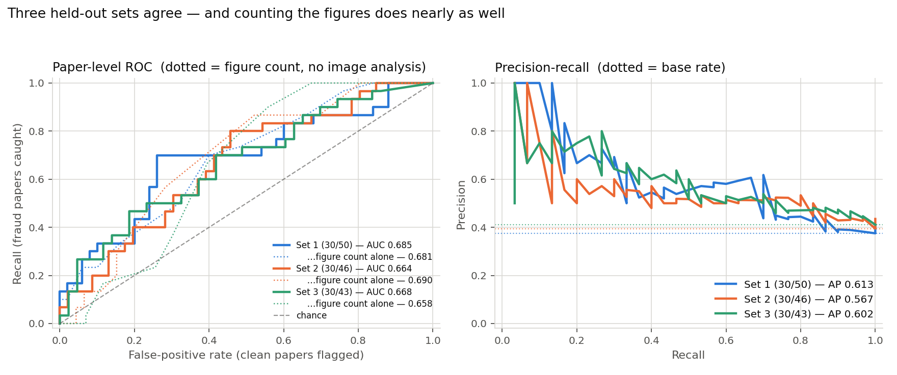
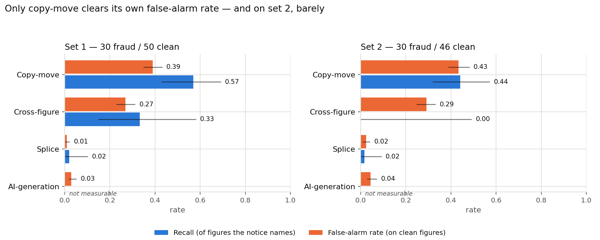
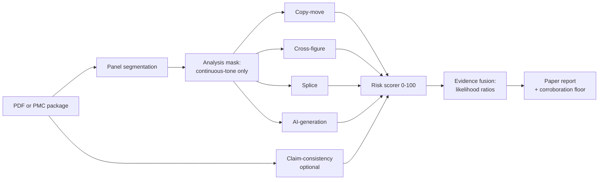

# ScholarGuard

**Figure-integrity screening for scientific papers — with every limitation measured and disclosed.**

[](https://github.com/guru-bharadwaj20/Scientific-Figure-Integrity-Analyzer/actions/workflows/tests.yml)
&nbsp;
&nbsp;
&nbsp;

ScholarGuard screens a paper's figures for duplication, cross-figure reuse, splicing and AI-generation artifacts, then checks the text's claims against the figures. It surfaces leads for a human reviewer — and tells you exactly how much to trust each one.

**The evaluation is the point of the project.** Detectors are easy to write and easy to fool yourself about. Most of the work here went into measuring how often each one is wrong, on real retracted papers, and into withdrawing the improvements that did not replicate.


<p align="center">
  
  
</p>

---

## Where it stands

Measured on **three independent held-out sets** of real PubMed Central papers — 30 formally-retracted image-fraud papers each, against 50, 46 and 43 clean controls, with no overlap between sets or with anything used for tuning.



| | Set 1 (30/50) | Set 2 (30/46) | Set 3 (30/43) |
|---|---|---|---|
| ROC-AUC (0.5 = chance) | 0.685 | 0.664 | 0.668 |
| **…with figure count controlled** | **0.571** | **0.632** | **0.625** |
| *Figure count alone, no image analysis* | *0.681* | *0.690* | *0.658* |
| Average precision | 0.613 | 0.567 | 0.602 |
| Precision / recall at the cutoff | 0.60 / 0.70 | 0.52 / 0.77 | 0.53 / 0.60 |

It finds roughly **6–8 in 10 known-fraud papers** while flagging **28–47% of clean ones** — a triage aid, not a verdict machine.

**Read rows 2 and 3 together.** Retracted papers simply have more figures (median 7.5 vs 5.0), so counting them predicts retraction about as well as the whole pipeline does — better, on set 2. Comparing only papers with an *identical* figure count, the ranking pooled across all three sets is **0.610 (95% CI 0.482–0.725, 439 matched pairs)**: probably real signal, roughly a fifth as strong as the raw number suggests, and still not separable from chance. Every evaluation run prints this control.

### Per detector



Copy-move has the clearest sensitivity, replicated three times: it catches about **half** the figures a retraction notice names (0.57 / 0.44 / 0.59). Cross-figure lands at 0.33 / 0.00 / 0.31, splice at 0.02 on every set. AI-generation recall is unmeasurable — no notice in any set describes a figure as generated.

But read the error bars, not the bars: **across all three sets, every detector's recall interval overlaps its own false-alarm interval.** Copy-move comes closest and does not manage it. This tool surfaces leads; it does not yet demonstrate that it surfaces the right ones more often than the wrong ones.

**One detector has never been evaluated at all.** Claim-consistency needs an `ANTHROPIC_API_KEY`, and every run above was made without one — so it was skipped on all 1,475 figures while still holding 10 of the 100 risk-score points. It is implemented and unit-tested against a mocked LLM, and has never been scored against a real paper. That is the largest unmeasured surface in the project.

### Findings worth more than the metrics

| | |
|---|---|
| 🎯 **The headline metric was measuring the wrong thing** | Paper-level ROC-AUC could not distinguish this pipeline from `len(paper.figures)`. Found by benchmarking against the dumbest possible predictor; now a permanent line in every report. |
| 📉 **An "improvement" that did not replicate** | A trained AI classifier lifted set 1 from 0.685 → 0.733. On set 2 it was the *worst* of three configurations, with triple the false-alarm rate. Disabled by default; the whole arc is documented rather than deleted. |
| 🔧 **A threshold, not a model** | Most of that apparent gain was reproducible by a two-line threshold change with no classifier at all. |
| 🔁 **One held-out set is not enough** | The same detector's false-alarm rate moved 1.4% → 5.4% between sets with no code change. |

Two further changes were built, measured, and **declined**: a conformal + Benjamini–Yekutieli count correction (it ranks *worse* than the confound it removes) and switching the headline to the noisy-OR posterior (a +0.073 win on set 1 that did not replicate).

**→ [Full evaluation: stage by stage, including what was withdrawn](EVALUATION.md)**

---

## Quickstart

```bash
pip install -r requirements.txt          # Python >= 3.10
export ANTHROPIC_API_KEY=sk-ant-...      # optional — enables claim-consistency
python run_scholarguard.py --pdf path/to/paper.pdf
```

Writes one integrity report (JSON + Markdown) with a paper-level risk score. Without an API key it still runs every image forensic and reports what it skipped. All behaviour lives in [src/config/config.yaml](src/config/config.yaml).

```bash
pytest -q                             # 351 passed, 1 skipped
docker build -t scholarguard .        # CPU-only image, datasets mounted not baked
```

<details>
<summary><b>Run the web app</b> — FastAPI bridge + Next.js frontend</summary>

```bash
# 1. API bridge on :8000
pip install -r server/requirements.txt
uvicorn server.main:app --port 8000

# 2. Web app on :3000
cd web && npm install && npm run dev
```

Open http://localhost:3000. Upload a PDF or run a bundled real example; progress
streams live over Server-Sent Events, parsed from the pipeline's own log lines
rather than fabricated. The bridge is thin transport with zero pipeline logic.

The results view shows **everything the report contains**, because a screening
tool that cannot be checked is not worth much:

| | |
|---|---|
| **Score breakdown** | Points out of each detector's maximum, its status and its finding — including detectors that scored nothing, since "skipped" is information. |
| **Calibrated evidence** | The likelihood-ratio layer: each detector's `log P(fire\|fraud)/P(fire\|clean)` as a signed bar, so a detector that ran and stayed quiet visibly argues the other way. |
| **Detector measurements** | Splice's per-cue block counts, the AI classifier's `p(AI)` when loaded, the vision model's observations next to the claims it checked. |
| **Corroboration** | Flagged on any figure two or more independent detectors agree on — the signal the held-out evaluation found most informative. |
| **Reliability badges** | Every detector is named alongside its measured false-alarm rate and recall, everywhere it appears. |
| **Triage** | Sort by agreement (default), score, or document order; filter to figures worth reviewing. |
| **Downloads** | The JSON report and Markdown summary the pipeline writes, plus the raw JSON inline. |
| **Backend status** | Reachability and load, so a saturated or stopped backend is visible before you upload rather than after. |

The server caps concurrent analyses (each is minutes of CPU) and refuses beyond
a queue depth with a 503 the UI explains.
</details>

---

## How it works



| Detector | Signal | Technique |
|---|---|---|
| **Copy-move** | Regions duplicated within one figure | content-gated SIFT + g2NN + RANSAC + ZNCC region growing + noise-residual clone test, with a dense-field block-DCT tier for smooth blots SIFT misses |
| **Cross-figure** | One figure reusing another | pHash + CNN embeddings + FAISS + geometric verification + clone test, with publisher-furniture filtering |
| **Splice** | A region pasted from another source | noise-inconsistency + JPEG-ghost/ELA, flagged only where a foreign noise level *and* a foreign compression fingerprint agree |
| **AI-generation** | GAN/diffusion artifacts | FFT spectral falloff + azimuthal anisotropy + PRNU wavelet residual, conditioned on JPEG compression (optional CNN) |
| **Claim-consistency** | Text claims vs. figure content | PDF parsing + Claude API structured extraction + multimodal figure observation |

The paper decision **leads with corroboration**: a figure two or more independent detectors flag is real evidence and lifts the paper to at least "high", whereas a paper full of lone single-detector fires — which merely compound across many figures — is not.

<details>
<summary><b>The two ideas doing the heavy lifting</b></summary>

**Content gating.** Scientific figures are collages, and repeated axis labels, tiled markers and identical scale bars are *geometrically identical to forgery*. Running matchers over the whole composite produced most of the early false alarms. [panel_segmentation.py](src/preprocessing/panel_segmentation.py) splits each figure by recursive X-Y cut, types every panel, and builds an analysis mask of continuous-tone panels minus text and scale bars. The matchers only ever see that mask, so legitimate repetition never reaches them.

**Noise-residual clone test.** ZNCC answers "do these regions *look* alike?" — true for both a copy-paste and two honest replicate blots. [residual_similarity.py](src/forensics/residual_similarity.py) asks the physically decisive question instead: after alignment, do the two regions share **one exposure's sensor-noise field**? Photon and read noise are independent per capture, so a genuine look-alike scores ≈0 residual correlation while a true clone carries its noise with it. The verdict (`clone` / `independent` / `inconclusive`) multiplies detector confidence — and heavy JPEG that destroys the residual returns *inconclusive* rather than a false "independent".

**Evidence fusion.** The 0–100 score is a transparent fixed-weight sum, good for explaining *what* fired but unable to down-weight a detector that fires nearly as often on clean papers as on fraud. [evidence_fusion.py](src/pipeline/evidence_fusion.py) adds a parallel layer combining detectors by calibrated likelihood ratios: a detector whose fire rate barely differs between classes has LR ≈ 1 and contributes ≈0 evidence automatically. Shipped defaults are deliberately weak so an uncalibrated install cannot over-claim.
</details>

Everything runs CPU-only except the optional AI classifier, which trains on a GPU and infers on CPU. The API key is read from the environment and never hardcoded.

---

## Project structure

```
src/
  ├─ preprocessing/   panel segmentation, content typing, text/scale-bar masking
  ├─ detectors/       copy-move (+ dense-field tier), cross-figure, splice, ai-generation
  ├─ forensics/       frequency, noise residual, clone test, JPEG blockiness
  ├─ pipeline/        orchestrator, risk scorer, evidence fusion, report builder
  ├─ evaluation/      benchmark runner, metrics (Wilson CIs, ROC/PR, LOOCV), error analysis,
  │                   offline recalibration, conformal paper inference (measured, not shipped)
  ├─ nlp/             PDF parser, PMC-package ingestion, claim/vision extraction
  ├─ config/          config.yaml — single source of truth for every detector knob
  └─ utils/           image I/O (unicode-safe), torch thread policy, synthetic data
server/     FastAPI bridge (thin transport, zero pipeline logic)
web/        Next.js 14 + Tailwind + Framer Motion + Recharts + react-three-fiber
scripts/    data acquisition (PMC Open Access, Retraction Watch)
tests/      pytest suite — 351 passing, 1 skipped
```

## Documentation

| | |
|---|---|
| **[EVALUATION.md](EVALUATION.md)** | The full report card and changelog — every stage, every number, and both sides of every reversal. |
| **[DATASETS.md](DATASETS.md)** | Rebuilding the corpora from PMC and Retraction Watch, figure-level annotation, and the optional classifier training. |

---

*Flags are leads for human review, not proof of misconduct. ScholarGuard analyzes figures locally; the Claude API is used only for optional text and claim extraction.*
